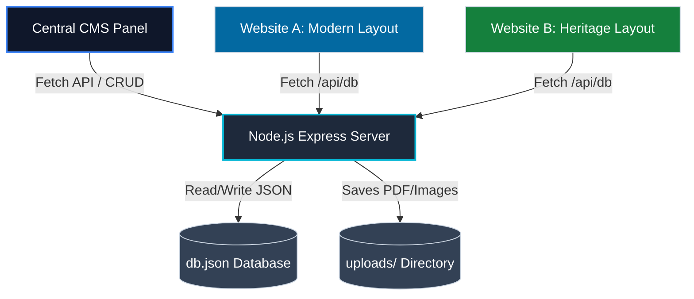

# Bermuda Department of Energy (energy.bm)
## Central Multi-Site Content Management System (CMS) & Dynamic Websites

This repository contains the production-ready full-stack central Content Management System (CMS) and decoupled dynamic frontend websites. 

This platform enables the Department of Energy to manage all content dynamically from a single panel. It feeds **two separate frontend website designs** (Modern layout and Heritage layout) developed by different teams, serving as a unified Headless CMS.

---

## 1. System Architecture: Full-Stack Headless CMS

The system is powered by a Node.js Express server acting as the central API gateway. It maintains a persistent JSON-file database (`db.json`) and handles real file uploads.



### Key Components Built
1. **Persistent Backend Server (`server.js`)**:
   - Exposes RESTful API endpoints (`/api/news`, `/api/policies`, `/api/kpis`, etc.) supporting complete GET, POST, PUT, and DELETE operations.
   - Saves content adjustments directly to `db.json` which persists across server restarts.
   - Implements real file uploading via Multer. Saves uploaded files to `/uploads/` and registers file records inside the media database.
2. **CMS Admin Panel (`index.html` + `app.js`)**:
   - Refactored to communicate directly with the Express API endpoints.
   - Binds form uploader UI items to real HTML file inputs. Uploading images or policy PDFs executes real backend file transfers.
   - Visualizes live previews by embedding the actual dynamic websites inside dynamic iframes.
3. **Website Design A (`/website_a/`)**:
   - Modern layout using a clean sans-serif layout and electric blue aesthetic.
   - Fetches and displays news, projects, trackers, KPIs, and settings dynamically on load.
4. **Website Design B (`/website_b/`)**:
   - Traditional layout using elegant serif typography and a forest green government theme.
   - Filters the global database feed to render official policies, registry links, announcements, and side-panel metrics.

---

## 2. Running the System Locally

### Prerequisites
Make sure you have Node.js installed.

### Installation
Run the following command to download dependencies (`express`, `cors`, `multer`):
```bash
npm install
```

### Launching the Server
Start the local server by running:
```bash
npm start
```
The server will start listening on port 8000:
`Bermuda DoE CMS Server running at http://localhost:8000`

---

## 3. Security Credentials & Launch URLs
Once the server is running, access the portals using these details:

### Secure Staff Login Credentials
* **Authorized Email**: `energy@gov.bm`
* **Security Password**: `bermuda2026`

### Access URLs
* **Central Admin CMS**: [http://localhost:8000/](http://localhost:8000/) (Enter credentials above to sign in)
* **Unified Active Portal**: [http://localhost:8000/portal](http://localhost:8000/portal) (Dynamically redirects to the selected active layout theme chosen in the CMS Settings tab)
* **Website Design A (Modern Blue)**: [http://localhost:8000/website_a/](http://localhost:8000/website_a/)
* **Website Design B (Heritage Green)**: [http://localhost:8000/website_b/](http://localhost:8000/website_b/)

---

## 4. Suggested Demo Steps for Client Presentation

1. **Open all three portals** in separate browser tabs: the CMS, Website A, and Website B.
2. **Add a news release** in the CMS. Set the target site to **Website A Only** and status to **Published**. Click **Publish**.
3. **Upload an image file** during the news creation. Point out that the file is actually sent to the backend and stored under the `/uploads` folder.
4. **Go to Website A** and refresh. You will see your new announcement and uploaded photo appear instantly. Go to **Website B** and refresh — note that the announcement is absent since it was targeted at Website A only.
5. **Change a global indicator**: In the CMS, navigate to **Dashboard Metrics**, change the *EV Adoption* value to a new number, and click **Save**.
6. **Refresh both Website A and Website B** — note that the updated EV statistic has updated on both sites in real-time, styled in their respective layouts.
7. **Embed Live Preview**: In the CMS, click on **Multi-Site Live Preview** to show both websites loading in side-by-side frames, reflecting these changes.
