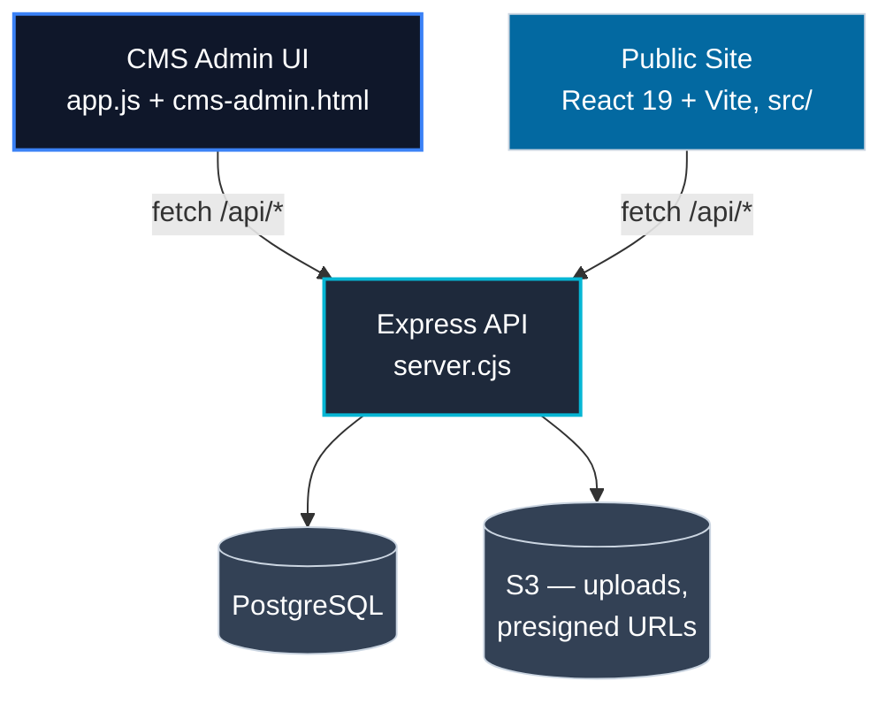

# Bermuda Department of Energy — energy.bm

Headless CMS and public website for the Government of Bermuda's Department of Energy.

A single Node.js/Express API backed by PostgreSQL serves two front ends: a
staff-facing content management system and the public React site.

---

## 1. Architecture


```mermaid
graph TD
    CMS[CMS Admin UI<br/>app.js + cms-admin.html] -->|fetch /api/*| API[Express API<br/>server.cjs]
    SPA[Public Site<br/>React 19 + Vite, src/] -->|fetch /api/*| API
    API --> DB[(PostgreSQL)]
    API --> S3[(S3 — uploads,<br/>presigned URLs)]

    style CMS fill:#0f172a,stroke:#3b82f6,stroke-width:2px,color:#fff
    style API fill:#1e293b,stroke:#06b6d4,stroke-width:2px,color:#fff
    style SPA fill:#0369a1,stroke:#cbd5e1,stroke-width:1px,color:#fff
    style DB fill:#334155,stroke:#cbd5e1,stroke-width:1px,color:#fff
    style S3 fill:#334155,stroke:#cbd5e1,stroke-width:1px,color:#fff
```

| Component | Location | Notes |
|---|---|---|
| API + CMS server | `server.cjs` | Express 5, JWT auth, RBAC, scheduler |
| Database schema | `server/schema.cjs` | Single source of truth; used by startup **and** `npm run migrate` |
| Request validation | `server/validate.cjs` | Zod schemas |
| Email | `server/mailer.cjs` | Optional SMTP; logs when unconfigured |
| Server data files | `server/data/` | Source spreadsheets for the fleet/solar importers |
| CMS admin UI | `app.js`, `cms-admin.html`, `styles.css` | Vanilla JS, no build step |
| Public website | `src/` | React 19, Vite 8, Tailwind 4, React Router 7 |

> **Note:** a second copy of the public site previously lived in `portal/`. It was
> a stale fork and has been removed — `src/` is the only front end. Two files that
> existed only in that copy are preserved for reference in `docs/legacy-portal/`.

### Storage

Content lives in PostgreSQL. Uploaded files go to S3 when AWS credentials are
configured (served via 1-hour presigned redirects through `/uploads/:filename`),
otherwise to the local `uploads/` directory.

---

## 2. Running locally

### Prerequisites
- Node.js 20+
- PostgreSQL 15+ (or use `docker compose up db`)

### Setup

```bash
cp .env.example .env      # then edit database credentials
npm install
npm run migrate           # create tables and seed first-run content
```

The first migration seeds a single Administrator account. If you did not set
`SEED_ADMIN_PASSWORD`, a **random password is generated and printed once** to the
console — copy it before the output scrolls away. There is no default password.

### Run

```bash
npm start                 # API + CMS on http://localhost:8000
npm run dev               # public site on http://localhost:5173 (proxies /api to :8000)
```

| URL | What |
|---|---|
| http://localhost:8000/ | CMS admin (sign in with the seeded account) |
| http://localhost:5173/ | Public website (Vite dev server, HMR) |
| http://localhost:8000/portal | Public website served from `dist/` after `npm run build` |
| http://localhost:8000/health | Health check (always 200; reports DB status in the body) |

### Docker

```bash
JWT_SECRET=$(node -e "console.log(require('crypto').randomBytes(32).toString('hex'))") \
  docker compose up --build
```

Builds the public site from `src/`, runs the API, PostgreSQL and nginx.

---

## 3. Roles and permissions

| Role | Can do |
|---|---|
| **Viewer** | Read all content. No writes. |
| **Editor** | Create and edit drafts. Cannot publish, approve, or modify already-published items. |
| **Approver** | Publish and approve content; read contact/newsletter submissions; approve media. |
| **Administrator** | Everything, plus staff accounts, settings, deletion, audit logs and the recycle bin. |

Manage accounts in the CMS under **Admin → Staff Accounts** (`/api/users`,
Administrator only). Every user can change their own password via
`PUT /api/auth/password`.

### Editorial workflow

- **Scheduling** — items with status `Scheduled` and a `scheduled_publish_date`
  go live automatically; a scheduler runs every 5 minutes.
- **Versioning** — policies, consultations and static pages snapshot on every
  edit and can be restored.
- **Recycle bin** — deletes are soft; items are recoverable for 30 days.
- **Audit log** — every mutation is recorded with user, action and timestamp.

Anonymous callers to the public list endpoints never receive items in `Draft`,
`Scheduled`, `Pending` or `Hidden` status.

---

## 4. Testing

```bash
npm test                  # run once
npm run test:watch
npm run test:coverage
```

Frontend tests use jsdom; backend tests import the Express app directly (it only
binds a port when run as `node server.cjs`) and mock the database layer.

---

## 5. Deployment

See [docs/AWS-DEPLOYMENT.md](docs/AWS-DEPLOYMENT.md) for the full AWS walkthrough
(Elastic Beanstalk + RDS + S3 + CloudFront), or use `deploy-aws.sh`.

### Required production environment

| Variable | Purpose |
|---|---|
| `NODE_ENV=production` | Enables TLS to the database and production behaviour |
| `JWT_SECRET` | **Required** — the server refuses to boot without a strong, non-default value |
| `DATABASE_URL` | RDS connection string |
| `PG_CA_CERT` | Path to the RDS CA bundle — enables certificate verification |
| `APPROVED_ORIGINS` | Comma-separated allowed origins (CORS **and** CSP `connect-src`) |
| `AWS_S3_BUCKET`, `AWS_REGION`, `AWS_ACCESS_KEY_ID`, `AWS_SECRET_ACCESS_KEY` | File uploads |
| `CLOUDFRONT_URL` | Public site domain, for asset fallbacks and CMS preview frames |

Without `PG_CA_CERT` (or `PG_SSL_REJECT_UNAUTHORIZED=true`) the database
connection is encrypted but the server is not authenticated, and a warning is
logged on every boot.

---

## 6. Data imports

Two spreadsheets drive the vehicle and solar dashboards. Replace them from the
CMS (**Data & Tools → Solar Registry**, and the data-files manager) rather than
editing files on disk:

| Key | File | Populates |
|---|---|---|
| `vehicles` | `Vehicles by Fuel Type.xls` | EV fleet breakdown (`/api/vehicles/fleet`) |
| `solar` | `Solar Panel Application 2019-now.xlsx` | Solar registry, GIS heat map, solar stats |

Uploads land in `server/data/`. The solar import replaces the whole table inside
a single transaction — a failure mid-import rolls back rather than leaving the
registry half-populated. Rows that cannot be inserted are reported in the
response instead of being silently dropped.
